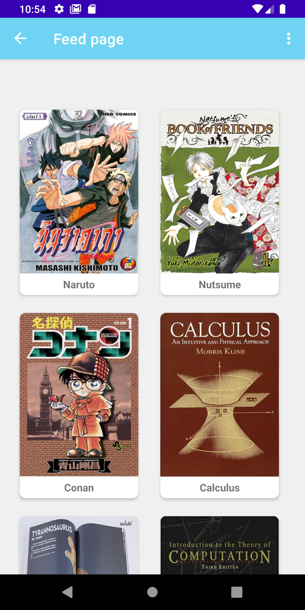

# Swabook App 📚
EN813702 Mobile Application Project 
<b>Swabook</b> is an android application for giving,borrowing and swapping books.  🔄📘

<b>Group 9 ID:MAppDev20-09</b>  
Project name: แอปให้และยืมหนังสือระหว่างเพื่อน  
Member names: 
-> Nantawat Nanboonma     ID : 61304500-3 	Email : nantawat.na@kkumail.com 
-> Jirayu Puakkuntod	     ID : 613040454-4 	Email : jirayu.puakkuntod@kkumail.com 
-> Chutikan Pankam	     ID :613040463-3 	Email : p_chutikan@kkumail.com 
Proposal document link: <a href="https://docs.google.com/document/d/1zFkhw800wkISlyUpszlBMntE3pbFkm08w63oKhKC2MA/edit?usp=sharing">Proposal Document</a> 
Proposal slide link: <a href="https://docs.google.com/presentation/d/1sCy7sVuPHWvKNLvpFyxzBL4avnApMa1sCUNy6kNTmdg/edit?usp=sharing">Proposal Slide</a> 
Prototype: <a href="https://xd.adobe.com/view/4887a689-8b59-4bc9-9d1a-112d552a6568-1dd4/?fbclid=IwAR02l7TRK8sjKsxh1d246l2iS4Kh73xtyDNX3h_JmDr4fY8eVoXu3ZrFWpA">Prototype-XD</a> 
Progress slide link: <a href="https://docs.google.com/presentation/d/1bmXoYePMdhcR1HnEhdVUIK5UhNAnEnZPAa6iNDa71cY/edit#slide=id.g63da1a4385_0_0"> Progress slide</a> 
Progress demo video link:<a href=""><a href="https://drive.google.com/file/d/1_zNu5n_Unca220-5hl_DdeIwRtGe4UvO/view?usp=sharing"> Progress Demo</a> 
Final Slide Presentation link: 
Final demo video link: 
Project source code at github: 
Project photos: 
# Member Implement
🔥 <b>Nantawat : </b>
  - Lab 4 Login activity design
  - Lab 6 Login fragment
 
  - Lab 7 Up button, Post fragment
  
  - Lab 8 Pick image from gallery
 
  - Lab 9 ViewModel (the screen orientation changes the app data is still persistent)

🌊 <b>Chutikan :</b> 
  - Lab 4 Login activity design
  - Lab 6 Feed fragment (Old) 
 
  - Lab 7 Option menu(to Post fragment)
 
  - Lab 8 Timber
 
  - Lab 9 ViewModel (the screen orientation changes the app data is still persistent)

⚡ <b>Jirayu :</b> 
  - Lab 4 Login activity design and check vaild
  - Lab 6 Register fragment, Book fragment, Feed fragment (New) 
   
  - Lab 7 Option menu(to Profile fragment), Profile fragment, Conditional fragment
    
  - Lab 8 Implicit intent(Share)
 
  - Lab 9 ViewModel (the screen orientation changes the app data is still persistent)
